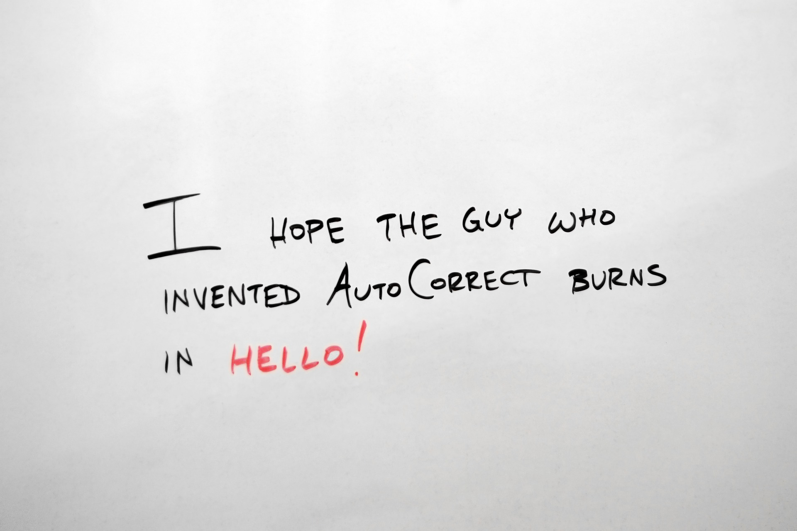
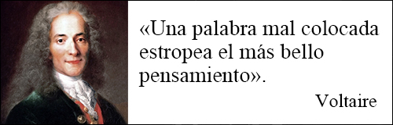

Brujitos, brujitas y brujites, _welcome_! ✨

Quiero hablar un poco más en detalle sobre la corrección de estilo. La mejor forma de definir qué es la encontramos en las palabras de Cristina Núñez: **«En la corrección de estilo se corrige todo menos el estilo»**. 

Una frase muy chula que no deja nada claro, ¿verdad? Voy a intentar explicarlo un poco más. La corrección de estilo es una intervención que se realiza en el texto para que comunique perfectamente todo lo que el autor (o autora) quiere decir, de forma que  el lector lo entienda en una primera lectura. Este tipo de corrección lo realiza un corrector de estilo, un oficio que surgió con la aparición de la imprenta en 1440 ([Antonio Hidalgo Navarro](https://www.uv.es/ahidalgo/)) y, a día de hoy, es esencial en cualquier editorial.

A priori, se puede pensar que leer un texto y modificarlo para que sea comprensible es fácil, ¿no? Cualquier persona que haya leído suficiente puede hacerlo. Esta es una idea que está muy extendida y se aleja terriblemente de la verdad. Ser corrector de estilo suena fácil pero no lo es. En absoluto. 

Además de aspectos formales (faltas de ortografía, puntuación erratas, formato), la corrección de estilo busca conseguir una redacción más clara y concisa que permita una lectura fluida, clara y eficaz. El objetivo del texto es comunicar y debemos conseguirlo sin «apoderarnos» del texto del autor.

Por otro lado, destacar que es una **labor humana irremplazable**. A día de hoy no existe un programa o _app_ capaz de controlar el estilo y el significado del texto. Por poner un ejemplo: ¿cuántas veces vuestro editor de textos no ha detectado una tilde diacrítica? ¿O no ha reconocido como erróneo un error de «s» y «d» como «de sentó»? 

Además, trabajamos adaptándonos al texto que nos dan. No es lo misma obra literaria que un texto administrativo o publicitario. Son totalmente distintos y, como tal, debemos tratarlos de forma diferente sin perder la voz del autor. 

Todas estas cositas, y muchas más, solo las puede ver el ojo humano. Lo que me lleva los siguientes apartados: ¿qué hacemos y qué **no** hacemos como correctores de estilo?

## ¿Qué se hace en una corrección de estilo?

Muchas cosas. Muchísimas. Revisamos todos los elementos del texto e intentamos que el resultado final quede bonito, claro, correcto y que al autor le encante. Evidentemente, ante la duda de poner o no un cambio, siempre se señala para que el autor tome la última decisión.

Dicho esto, he hecho un listado con los aspectos más relevantes en los que nos fijamos, aunque estoy segura que me voy a dejar alguna cosa fuera:

- **Corregir los errores gramaticales, ortográficos, de léxico y de sintaxis**. Detectamos que las palabras empleadas signifiquen lo que deben significar, estén correctamente escritas y cumplan con su función gramatical. Los errores asociados a este punto suelen venir por desconocimiento de las normas (como nuestro querido «guion» que sigue costando ponerlo sin tilde) o por una mala redacción. La mayoría de veces son preposiciones, conjunciones inadecuadas y mal uso de tiempos verbales.
- **Ajustar la puntuación**. Las comas, los puntos, las rayas de diálogo, los puntos suspensivos y los dos puntos son nuestros mejores amigos y peores enemigos. Con esto buscamos que el texto sea más elegante, más duro, menos entrecortado, etc. También facilitamos la comprensión por parte del lector.
- **Revisar las concordancias**. Sobre todo, suelen ser las de género y número, aunque a veces también encontramos errores en concordancias verbales.
- **Reformular oraciones confusas, erróneas y las ambigüedades no justificadas**. Muchas veces notamos que falta alguna palabra que debemos añadir o que existe repetición de algún término que es mejor quitar. Al escribir nos podemos liar mucho a la hora de formular una frase, así que nuestro trabajo como correctores es utilizar lenguaje claro y estructurado que facilitará la lectura del lector (valga la redundancia).
- **Pulir el texto**. Muy importante ya que se eliminan posibles cacofonías, _tics_ o muletillas. También se valora el vocabulario utilizado para ampliarlo, consiguiendo así una mayor riqueza expresiva.
- **Adecuar el registro al lector potencial y al género**. No es lo mismo corregir una novela juvenil que un texto jurídico. El lenguaje no es el mismo y debemos adecuarlo a cada uno de ellos.
- **Unificar lo diferentes estilos**. Normalmente, cuando escribimos lo hacemos en distintos días y eso provoca que el estilo cambie de una página a otra (y se nota). También, como correctores, debemos unificar los criterios que hayamos adoptado a lo largo del texto.
- **Conocer y aplicar la normativa de la Real Academia Española**. A día de hoy, debemos aplicar los criterios de la RAE y Fundéu en todos los textos salvo petición expresa del autor.

## ¿Qué **no** se hace en una corrección de estilo?

Tan importante es saber lo que se hace como lo que no. Hay muchos autores que tienen miedo a la hora de contactar con un corrector y este apartado intenta quitar ese miedito que tenemos todos cuando dejamos nuestra obra en manos de alguien que no somos nosotros:

- **Modificar el estilo del escritor**. Esto es lo principal. La corrección de estilo tiene la finalidad de potenciar lo que ha escrito el autor, pulir el diamante que es el texto. Es su diamante y está impregnado de su personalidad, la nuestra no debe aparecer.
- **Redactar o reescribir el texto**. Nuestra labor es corregir sobre lo ya escrito, no ponernos a escribir nosotros.
- **Cambiar la estructura del texto**. El texto es el que es y, personalmente, puede gustarnos más o menos. Sin embargo, eso no nos da el poder de reordenarlo o reestructurarlo según nuestros gustos personales. Jamás tocamos el esqueleto del texto.
- **Analizar la novela e intervenir en la historia, las tramas o los personajes**. Como correctores, nuestro trabajo no es analizar la obra (estructura, trama, personajes, puntos de giro, etc.) La historia no es nuestra, ni tampoco lo son los elementos que intervienen en ella. Si detectamos alguna incoherencia, debemos señalárselo al autor, nunca cambiarlo nosotros.
- **Justificar nuestras intervenciones**. Llevamos a cabo muchos cambios. Muchísimos. Explicar de forma teórica por qué realizamos un cambio u otro, además de llevarnos un tiempo del que no disponemos, no es necesario de cara al autor o al editor. Junto a la corrección, entregamos un informe con los criterios que hemos seguido y ejemplos de algunas de sus aplicaciones.
- **Revisar la traducción**. La labor de la traducción corre a cargo del traductor. Nosotros no debemos revisar si está bien traducida o no aunque, en caso de duda, podemos consultarlo.
- **Comprobar la veracidad de los datos del texto**. En los textos más técnicos, se cuenta con un corrector de concepto para comprobar que todo lo que aparece en la obra es correcto.
- **Revisar el texto cada vez que el autor cambia algo**.Este punto es muy importante: corregimos el texto una vez. Si después de nuestra corrección el autor realiza algunos cambios y nos lo vuelve a enviar, debemos cobrarle por una segunda corrección ya que revisamos todo el texto de nuevo. Precisamente por esto el autor nos envía el texto cuando está terminado y, tras el corrector de estilo, se contrata a un corrector ortotipográfico para revisar aquello que ha podido pasarse en una primera corrección.

Así acaba la entrada de hoy. Me dejo alguna cosita en el tintero de la que hablaré en un futuro pero, por ahora, creo que he conseguido dejar claros dos puntos principales: qué hacemos los correctores de estilo y, más aún importante, qué no hacemos.

Para concluir el post de hoy quiero dejar un mensaje a quienes están dudando si contar con un corrector o no.

_Relax_. Podéis respirar con calma y confiar en nosotros. No vamos a poner en riesgo tu obra porque nuestra labor es hacer que brille con la luz que ya tiene.

¡Hasta la próxima, _wizards_! 🧙‍♀️
