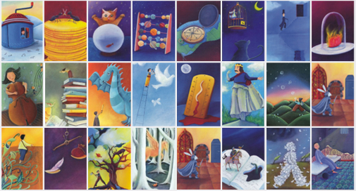

Brujitos, brujitas y brujites, _welcome_! ✨

Hoy he venido a presentaros un reto creativo de escritura que se me ha ocurrido mientras estaba jugando a un juego de mesa con mi familia. Sí, así de loco suena y así de loco es.

## ¿Qué es un reto de escritura creativa?

De forma fácil, rápida y sencilla, un reto de escritura creativa consiste en improvisar y potenciar la creatividad que llevamos todos dentro. ¿Y cómo se hace? Retando al escritor a seguir una serie de pautas para que salga de su zona de confort, escriba algo que nunca pensó qué haría y tenga la mente despierta para ser capaz de crear una historia con elementos que no esperaba.

Retos de escritura creativa hay cientos. Miles. Millones. Realmente puedes hacer un reto de escritura de absolutamente todo lo que queráis, desde juntar tres palabras al azar y escribir un relato hasta reinventar un cuento clásico conocido por todos. Hay algunas páginas y blogs en los que proponen este tipo de retos para motivar a toda la comunidad _escritoril_, como por ejemplo [Literup](https://blog.literup.com/52-retos-de-escritura-para-2020) o el [OrigiReto](https://nosoyadictaaloslibros.blogspot.com/2019/12/reto-de-escritura-2020-origireto.html), y también se han creado algunas apps que generan distintos personajes, escenarios o diálogos para ir creando la historia (te estoy mirando a ti, [Liternauts](https://www.literautas.com/es/apps/retos-de-escritura/)).

En definitiva, es **despertar tu cerebro y ponerte a escribir con una serie de pautas**. Y yo he decidido seguir el ejemplo y compartir con vosotros un nuevo reto de escritura creativa basada en un juego de mesa muy chulo que seguro que conocéis: el Dixit.

## Hablemos del _dixirreto_

Dixit es un juego que se basa en la creatividad ya que tiene cartas con ilustraciones que dejan volar la imaginación de cada uno. Y justo eso es lo que vamos a hacer en el _dixirreto_: escribir una historia inspirándonos en una de las cartas del juego.

He elegido un total de veinticuatro cartas al azar y he escrito el mismo número de objetivos, también al azar. El resultado es el que veis a continuación:

| Narrar un/una... | El protagonista es... | Basarlo en... | La temática es... |
| ------------- |:-------------:| ------|--:|
| Fábula | Pareja de hermanos | Redes sociales | Avance científico |
| Interrogatorio | Ser mitológico | Noche de halloween | Superhéroes |
| Asesinato | Niño de siete años | Película disney | Futuro distópico |
| Suceso cotidiano | Sentimiento | Canción veraniega | Realidad|
| Desastre natural | Personaje ficticio | Programa de TV | Suceso histórico |
| Leyenda | Animal o insecto | Mundo sin humanos | Reinventar un mito |

El dixirreto consiste en **escribir un relato que se inspire en una de las cartas y cumpla uno de los objetivos** elegidos de forma aleatoria. Voy a hacerlo cada dos semanas, alternando un post de escritura creativa con otro de un tema completamente distinto como corrección, edición, usos del lenguaje, maquetación o lo que me vaya saliendo. De esta forma podréis conocer tanto mi faceta creativa como la más _profesional_ (con muchas comillas).

Sé que este es solo un reto de escritura más basado, en este caso, en un juego de mesa. Sin embargo, estoy aquí para demostrarme a mí misma que puedo escribir sobre temas muy distintos, **salir de mi zona de confort y dejar volar mi imaginación**. 

Cada dos semanas llegará un nuevo relato y espero que os guste. Al fin y al cabo, todes les aquí presentes somos personas que amamos las letras, las historias y la creatividad. Y por favor, si alguien se anima con este reto, ¡que me lo diga sin dudarlo!

¡Hasta la próxima, _wizards_! 🧙‍♀️
