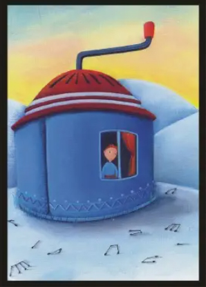

Brujitos, brujitas y brujites, _welcome_! ✨

Al fin ha llegado el día del primer [_dixirreto_](https://aliciaroma.es/blog/dixirreto/) del año y, la verdad, estoy deseando que lo leais. Para elegir la imagen y el objetivo he utilizado el azar y debo admitir que  lo que ha salido ha sido perfecto.

No quiero hacer una introducción más larga, prefiero dejar que las palabras del relato hablen por mí. Pero, como es lógico, antes voy a enseñaros la carta y el objetivo de esta semana para que podáis ver el relato con otros ojos:

**
Narrar un: suceso cotidiano
**

## Quien no teme a los cambios no ha vivido una mudanza

Ya no había vuelta atrás.

El que dijo que los cambios eran algo positivo no había tenido que vivir uno en su vida. O, mejor dicho, no incluía las mudanzas en su filosofía.

Una mudanza, algo bueno. Permíteme que lo dude.

Llevaba unos días viendo cómo desaparecían muebles a mi alrededor; ya me había quedado sin cama y sin sofá. A este paso iba a acabar durmiendo en el suelo con ese saco de babas que era el perro. Y, la verdad, el suelo no era digno de mí.

Tras una mañana ajetreada, la casa quedó completamente vacía. Había llegado el temido momento. Cogí aire y empecé a quejarme. Me gustaba mi pequeño reino y no quería irme. Evidentemente, lamentarme no sirvió de nada.

Cuando quise darme cuenta estaba en la casa nueva. La luz del sol entraba en el salón a través de una gran ventana, iluminando las docenas de cajas que había esparcidas por el suelo. Mis cajas con mis cosas. Al lado, la encimera de la cocina estaba llena de platos, vasos y cacerolas, y pude ver unas escaleras que llevaban a una segunda planta. «Al final no está tan mal» fue lo primero que pensé. Pronto me iba a arrepentir de mi primera valoración.

Comparada con la anterior, todo era más pequeño. Mal asunto. No tenía donde esconderme y eso era la primera de una larga lista de malas noticias: la luz del sol no daba de lleno en el sofá, la cocina era demasiado alta, hacía frío, los armarios eran poco profundos y las nuevas sillas eran lo más incómodo del mundo. Además, no sabía dónde comer y el baño aún no estaba terminado. Fantástico. 

Decidí irme a dormir pronto. Subí a mi habitación y vi que alguien se había adueñado de mi cama. Lo que me faltaba, olor a perro en mis sábanas. Sin dudarlo un momento, lo eché. Si pensaba que iba a destituirme aprovechando el cambio estaba muy equivocado. Aquí la reina soy yo.

A la mañana siguiente me desperté con la sensación de no haber descansado. Los crujidos nocturnos y los sueños raros me habían mantenido en un duermevela durante toda la noche. Lo mismo la casa venía con fantasma incluido. Lo que faltaba.

Dicen que los cambios son un lugar de partida y de encuentro. Dicen que los cambios son para mejorar. Dicen muchas cosas de los cambios, pero nadie habla sobre cambiar de hogar. Nadie habla sobre acostumbrarse a una casa que no es la tuya. Nadie habla sobre las mudanzas. 

Visto lo visto, casi prefería volver a mi transportín y quedarme a vivir en ese pedazo de plástico mientras expresaba mi descontento con maullidos lastimeros.

«Más vale malo conocido que bueno por conocer», pensé. Ese iba a ser mi lema a partir de ese momento.

Tenía mucho que hacer.

