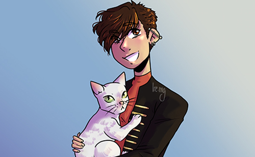
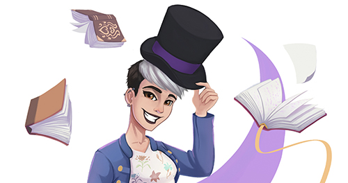
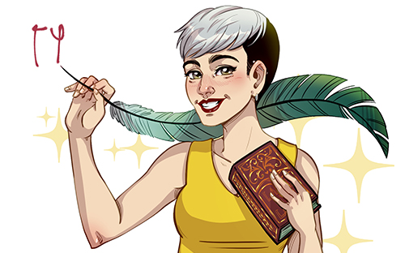

Brujites, brujitas y brujitos, _welcome_! ✨

Te presento mi primer post en este blog. ¿Y qué es? Una presentación. Inesperado, lo sé. Nadie comienza presentándose a sí mismo (nadie, nunca, jamás de los jamases ha pasado) así que voy a empezar por mi nombre: **_holi_, soy Alicia**. A secas. «¿Y de dónde viene Roma?», te podrás preguntar. Pues es una mezcla de mis dos apellidos, así de simple. Hace años lo elegí como nombre artístico (así soy, creando nombres artísticos para cosas relacionadas con la magia) y me gustó tanto que decidí utilizarlo como pseudónimo en casi todo.

Una vez desentrañado mi nombre, quiero hablarte sobre mí y, como aspiro a convertirme en escritora, lo voy a hacer de forma diferente. Quiero contarte una historia. 

## Hace mucho, mucho tiempo, en un reino muy lejano...

Nació una niña a la que llamarían Alicia Rodríguez Martín, aunque ella prefiere ser simplemente Alicia Roma. Era una niña curiosa, inquieta y siempre estaba dispuesta a aprender, tres elementos que siguen caracterizándola hoy en día.

Creció creando historias y mundos imaginarios hasta el temido momento de la vida adulta. «¿Qué hago ahora, si escribir no tiene futuro?», se preguntaba angustiada. La respuesta fue comenzar sus estudios en un módulo en imagen audiovisual mientras lo compaginaba con su trabajo y dejaba la escritura en un segundo plano. Poco después comenzó en la universidad y se metió de lleno a estudiar dos carreras: Comunicación Audiovisual y Periodismo.

Aun así, la joven sentía que faltaba algo en su vida y ese mismo año decidió fundar un **foro de rol narrativo** sobre la serie _Érase una vez_ y crear sus propios personajes, tramas e historias uniendo su imaginación con la de cualquiera que pasara por allí. Fueron unos cuantos años de aprendizaje continuo sobre elementos de la narración, creación de personajes y desarrollo de tramas que tuvieran sentido y en ese tiempo aprendió sobre escritura más de lo que ella misma había podido imaginar. Y no solo sobre escritura, sino también sobre diseño web, maquetación, programación y administración. La creatividad se disparó y, gracias a un hada mágica, un guardián de la luna y dos gemelos revoltosos, decidió que la escritura volvería a tener un lugar importante en su vida.

Mientras sus ganas por escribir crecían, también lo hacían su magia. En 2013 comenzó a **estudiar magia** en una prestigiosa escuela (no fue Hogwarts, jamás me llegó mi carta) y se formó como maga solidaria para regalar magia e ilusión a los colectivos más vulnerables de la sociedad. 

Creo que, llegados a este punto, podrás saber de dónde viene el pseudónimo que utiliza en twitter: ([MagaGramatical](https://twitter.com/MagaGramatical)).

Así, casi sin querer, hemos descifrado el primer momento fundamental en su vida: la creación del foro _Once Upon a Time_ y el comienzo de sus estudios en magia. El segundo llegó algunos años después, cuando el hada azul le concedió un deseo que ni ella misma sabía que tenía: pasar medio año en un reino muy, muy lejano donde trabajaría en el lugar más mágico del mundo. Para una joven cuyas tres pasiones son **la magia, escribir y viajar**, aquel destino era perfecto. En 2018 viajó a **Walt Disney World Resort** en Orlando (Florida) y allí, acompañada de los personajes de los cuentos que siempre había querido conocer, aprendió a regalar magia a habitantes de todo el mundo. 

Su barco volvió seis meses después y decidió que era el momento de acabar la universidad mientras seguía con su labor de voluntariado y escribiendo sin parar. Lo que nos lleva al tercer momento en 2019. El hada azul decidió visitarla de nuevo para poner frente a ella algo que se convertiría en su pasión: un curso de **corrección de estilo**. Se sintió tan fascinada que continuó por ese camino y se formó, también, como **correctora ortotipográfíca**. La magia y las letras han seguido con ella a lo largo de los años y, al fin, se han unido en un único punto pues desde ese instante ha dedicado todos sus esfuerzos a abrirse un hueco como correctora, escritora y redactora.

Y vivió feliz para siempre. Este debería ser el final. No obstante, la historia aún se está escribiendo. A sus veintiocho años continua formándose en todo aquello que llama su atención, escribe, lee, corrige y crea. Y sigue aprendiendo de todas aquellas personas que se cruzan en su camino.

Soñar con que vivir de escribir y corregir es posible. Al fin y al cabo, los sueños solo se cumplen si eres suficientemente valiente como para perseguirlos y luchar por ellos.

## Y colorín colorado...

Así acaba la historia, por ahora. Cada día se añadirá un nuevo capítulo a mi vida y espero aprender de absolutamente todo lo que me pase. Esta historia me define como persona y como profesional y, aunque no he hablado de los trabajos que he realizado o aquellos campos en los que me he formado, creo que no es importante porque la historia expresa quién soy, de dónde vengo y dónde estoy. Respeto a dónde voy, la verdad es que no tengo ni idea. Por suerte, aún no soy capaz de ver el futuro y es algo maravilloso.

**Esta soy yo, con mis pros, mis contras y mis cosas**. Y este va a ser mi blog, un lugar en el que se mezclarán temas como creatividad, escritura, corrección o lenguaje inclusivo (ese tema tabú que es tan necesario hoy en día). Quiero crear un espacio ameno a la par que informativo y este es solo el primer paso de este largo camino.

¿Te atreves a empezarlo conmigo? 🧙‍♀️

**Nota**: les artistes de las imágenes son **Ire.mg** (twitter: ([@Ire_mgg](https://twitter.com/Ire_mgg)), **Guille art** (twitter: ([@Guillerartart](https://twitter.com/Guillerartart)) y **Martha Ishbel** (twitter: ([@Marthaisbl](https://twitter.com/Marthaisbl)).

